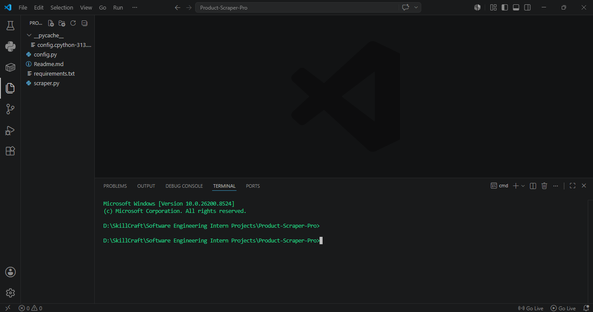
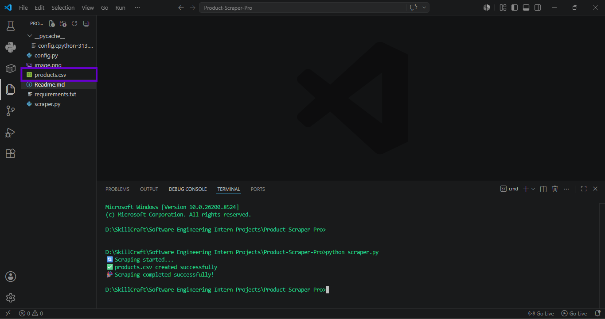

# 🛒 Product Scraper Pro
1-Month Software Engineering Internship at [SkillCraft Technology](https://skillcrafttech.com?utm_source=chatgpt.com) | Fourth Task: Product-Scraper-Pro 🚀

A Python-based web scraping project that extracts product information such as product names, prices, and ratings from an e-commerce website and stores the data in a CSV file.

---

## 🚀 Features

- Extract product names
- Extract product prices
- Extract product ratings
- Save data to CSV file
- Simple and clean code structure

---

## 🛠️ Technologies Used

- Python
- Requests
- BeautifulSoup4
- Pandas

---

## 📂 Project Structure

```text
Product-Scraper-Pro/
│
├── config.py
├── scraper.py
├── products.csv
├── requirements.txt
└── README.md
```

---

## ⚙️ Installation

Install required libraries:

```bash
pip install -r requirements.txt
```

---

## ▶️ How to Run

Run the project using:

```bash
python scraper.py
```

---

## 📊 Output

The program creates:

```text
products.csv
```

The CSV file contains:

- Product Name
- Price
- Rating

---

## 🧠 Working Process

1. Send request to the website.
2. Get HTML content.
3. Parse HTML using BeautifulSoup.
4. Extract product details.
5. Save extracted data into CSV file.

---

## 📋 Requirements

```text
requests
beautifulsoup4
pandas
```

---
### 👨‍💻 Author
## Abhishek Badiger Software Development Intern at  [SkillCraft Technology](https://skillcrafttech.com?utm_source=chatgpt.com).
### Before Running python scraper.py

### After Running python scraper.py

### products.csv Excel file
[text](products.csv)