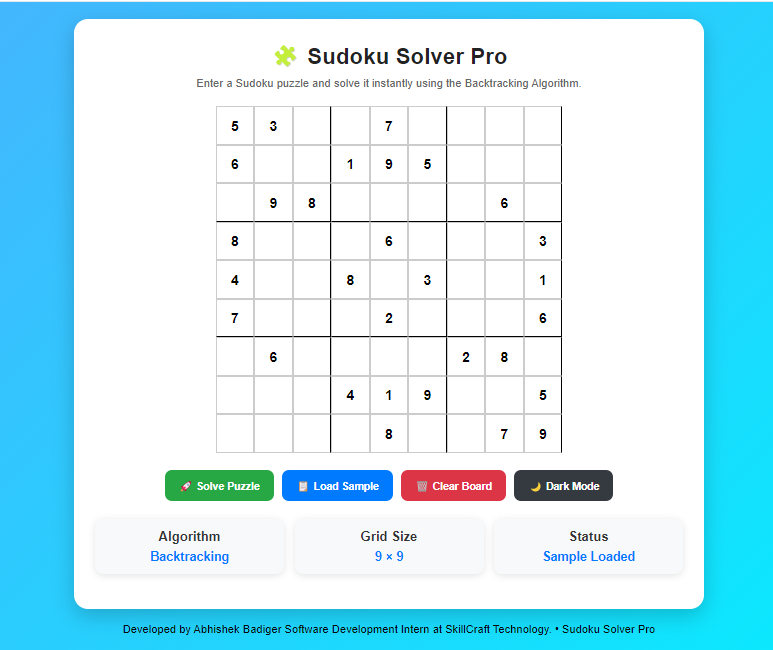
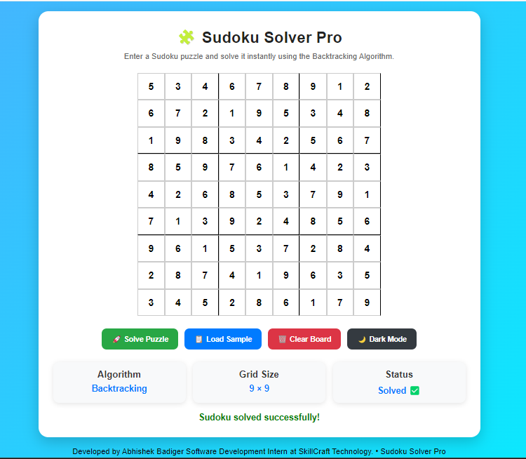
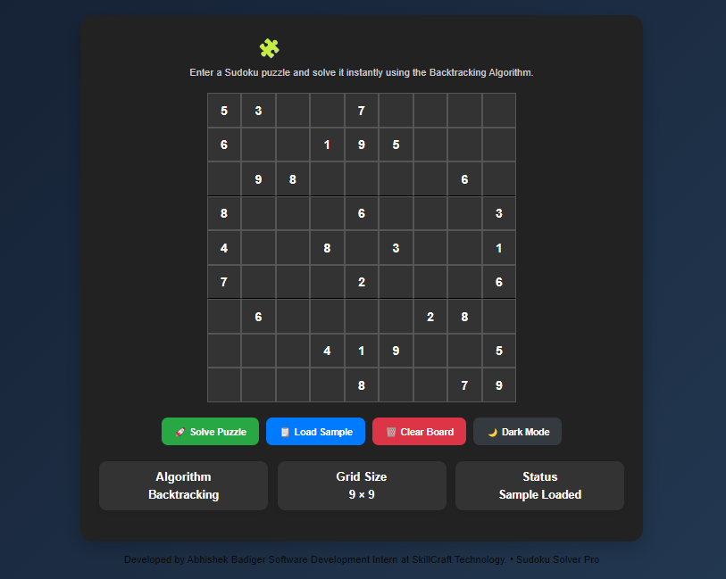
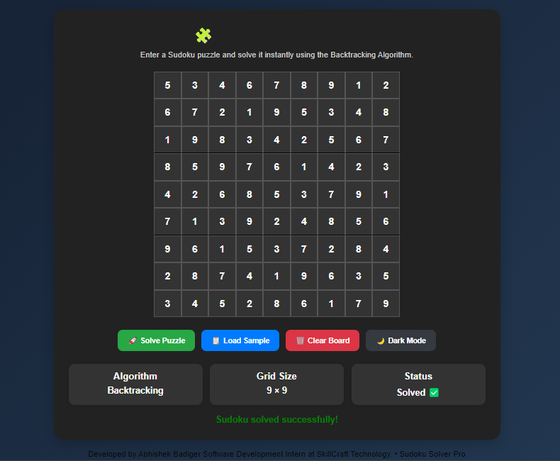

# 🧩 Sudoku Solver Pro

A clean, responsive web-based Sudoku solver built using HTML, CSS, and JavaScript. This project demonstrates the implementation of the **Backtracking Algorithm** to solve 9x9 Sudoku puzzles automatically.

## 🚀 Features

* **9x9 Sudoku Grid:** Intuitive interface for inputting puzzles.
* **Automatic Solving:** One-click solution using efficient recursive backtracking.
* **Sample Data:** Built-in function to load a sample puzzle for immediate testing.
* **Utility Controls:** Dedicated buttons to clear the board or reset state.
* **User Experience:** * Dark mode support.
    * Arrow key navigation (↑ ↓ ← →) for fast input.
    * Simple, minimalist UI design.

## 🛠️ Technologies Used

* **HTML5:** Structure and semantic layout.
* **CSS3:** Styling, grid layout, and dark mode theming.
* **JavaScript (ES6+):** Core logic, DOM manipulation, and backtracking implementation.

## 🧠 Algorithm: Backtracking

This solver utilizes the **Backtracking Algorithm**, a depth-first search approach:

1.  **Iterate** through each empty cell.
2.  **Attempt** to place numbers 1 through 9.
3.  **Validate:** Check if the number complies with Sudoku rules (no repeats in the current row, column, or 3x3 subgrid).
4.  **Recurse:** If valid, move to the next empty cell.
5.  **Backtrack:** If no number is valid, reset the current cell to empty and return to the previous cell to try a different value.

## 🎯 Sample Puzzle

Use the "Load Sample Puzzle" button to populate the board with the following configuration:

| | | | | | | | | |
|---|---|---|---|---|---|---|---|---|
| 5 | 3 | . | . | 7 | . | . | . | . |
| 6 | . | . | 1 | 9 | 5 | . | . | . |
| . | 9 | 8 | . | . | . | . | 6 | . |
| 8 | . | . | . | 6 | . | . | . | 3 |
| 4 | . | . | 8 | . | 3 | . | . | 1 |
| 7 | . | . | . | 2 | . | . | . | 6 |
| . | 6 | . | . | . | . | 2 | 8 | . |
| . | . | . | 4 | 1 | 9 | . | . | 5 |
| . | . | . | . | 8 | . | . | 7 | 9 |

---

## 💡 Solving Strategy Tips

If you are solving manually, follow these heuristics:
1.  **Prioritize:** Start with rows or columns that are already densely populated.
2.  **Elimination:** Cross-reference the row, column, and 3x3 box to identify candidate numbers for empty cells.
3.  **Hidden Singles:** Focus on cells where only one number is mathematically possible.
4.  **Iterate:** Repeat the process; filling one cell often unlocks possibilities for others.

## ▶️ How to Run

1.  **Clone or Download** this repository to your local machine.
2.  **Open** the project folder.
3.  **Launch** `index.html` in any modern web browser.
    * *Recommended:* Use the "Live Server" extension in Visual Studio Code for a better development experience.

## 📌 Note
This project was developed for educational purposes and as an internship submission.

### 👨‍💻 Author
## Abhishek Badiger Software Development Intern at SkillCraft Technology.

## ⭐ Result

After clicking Solve Puzzle, the system automatically fills all empty cells and shows the correct solution using the backtracking algorithm.

